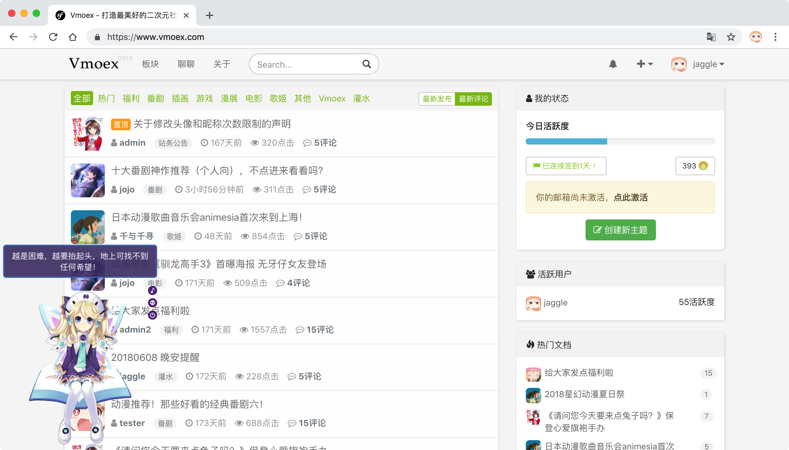
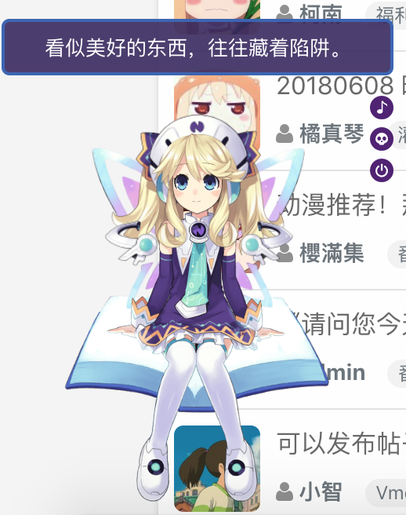

<h1 align="center">Vmoex - 期望成为最美好的二次元社区</h1>

    
    
    

vmoex是一个开源的二次元社区程序，同时也是一个多用户多角色的内容管理系统。

安装文档请参考：[INSTALL.md](INSTALL.md)

## 疗效

[戳我见效果](https://www.vmoex.com/)

## 依赖

- PHP   7.2+
- MySQL 5.7+
- Node  6.14+
- yarn 1.7+
- Redis 3.2+

## 功能

- gitbhu登录 ✅
- 邮箱验证、用户信息编辑功能 ✅
- 多国语言支持 ✅
- 丰富的后台管理功能 ✅
- 用户发帖、回复（支持@其他人） ✅
- 站内即时聊天、无刷新获取通知 ✅
- 支持markdown ✅
- 会员主页、关注他人、发送私信给他人 ✅

## 使用的第三方库

### 前端

- jquery
- bootstrap / bootstrap-social
- jquery-pjax
- sb-admin2 （管理端）
- nprogress
- socket.io (socketio client side)
- wangEditor
- at.js

### 后端

- symfony3.4
- workerman/phpsocket.io (socketio server side)
- snc/redis-bundle
- guzzlehttp/guzzle
- knplabs/knp-markdown-bundle (markdown support)
- intervention/image (图片处理)
- yzalis/identicon （头像生成）

> 😘 感谢第三方插件和框架~

## 看板娘

由[维基萌](https://www.wikimoe.com/)提供。

## 帮助与反馈

首先欢迎使用此程序搭建自己的二次元社区，在安装和使用中，遇到任何问题，请在本仓库的提交issue；如果你有搭建成功，欢迎在issues页提交自己的域名，
我会考虑将你的域名和网站名称放在此介绍页。
